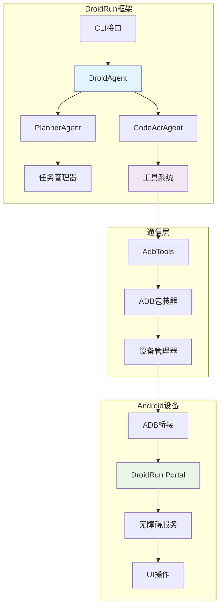

# DroidRun - AI驱动的Android设备控制框架

<div align="center">


**🤖 通过LLM智能体控制Android设备的综合框架**

[](https://python.org)
[](LICENSE)
[](https://docs.droidrun.ai/)

[📖 文档](https://docs.droidrun.ai/) • [🚀 快速开始](#快速开始) • [🎯 示例](#示例) • [🤝 贡献](CONTRIBUTING.md)

</div>

## 🌟 概述

DroidRun是一个前沿的框架，能够让AI智能体通过自然语言命令控制Android设备。基于**LlamaIndex**构建，由先进的**大语言模型(LLMs)**驱动，DroidRun在人类意图和设备自动化之间架起了桥梁。

### ✨ 核心特性

- 🧠 **AI驱动控制**: 使用自然语言控制Android设备
- 🔄 **多智能体架构**: 协调的规划和执行智能体
- 📱 **实时UI理解**: 先进的无障碍服务集成
- 🌐 **多LLM支持**: OpenAI、Anthropic、Google Gemini、Ollama等
- 🎯 **视觉理解**: 截图分析实现视觉理解
- 🔧 **可扩展工具**: 模块化工具系统支持自定义功能
- 📊 **内置遥测**: 性能监控和使用分析
- 🐛 **高级调试**: 轨迹保存和逐步分析

## 🏗️ 架构设计

DroidRun采用复杂的多层架构：



### 🔧 核心组件

#### 1. **DroidAgent** - 协调器
- **基于工作流的协调**: 规划和执行之间的协调
- **双重模式**: 直接执行或基于推理的规划
- **内存管理**和反思能力
- **错误处理**和重试机制

#### 2. **PlannerAgent** - 策略师
- **任务分解**: 将任务分解为可管理的步骤
- **上下文感知规划**: 使用UI状态和手机信息进行规划
- **动态重新规划**: 基于执行反馈的动态调整
- **多角色支持**: 支持不同的自动化风格

#### 3. **CodeActAgent** - 执行器
- **逐步任务执行**: 通过LLM推理执行任务
- **工具集成**: 设备操作的工具集成
- **视觉处理**: 截图分析处理
- **实时反馈**和错误恢复

#### 4. **Tools System** - 接口层
- **抽象基类**: 可扩展功能的抽象基类
- **AdbTools**: 通过ADB控制Android设备
- **IOSTools**: iOS设备支持(实验性)
- **自定义工具**: 轻松集成新功能

## 🚀 快速开始

### 前置要求

- **Python 3.10+**
- **Android设备**，已启用USB调试
- **ADB (Android Debug Bridge)**已安装
- **DroidRun Portal**应用已安装在设备上

### 安装

```bash
# 安装DroidRun
pip install droidrun

# 或从源码安装
git clone https://github.com/droidrun/droidrun.git
cd droidrun
pip install -e .
```

### 设置

1. **在Android设备上安装DroidRun Portal**:
```bash
droidrun setup
```

2. **配置你的LLM**(选择其一):
```bash
# OpenAI
export OPENAI_API_KEY="your-api-key"

# Google Gemini
export GEMINI_API_KEY="your-api-key"

# Anthropic
export ANTHROPIC_API_KEY="your-api-key"
```

3. **通过USB连接设备**并启用USB调试

### 基本用法

```python
import asyncio
from droidrun import DroidAgent, AdbTools, load_llm

async def main():
    # 为连接的设备加载工具
    tools = await AdbTools.create()

    # 初始化LLM
    llm = load_llm("OpenAI", model="gpt-4o")

    # 创建智能体
    agent = DroidAgent(
        goal="打开设置并检查电池电量",
        llm=llm,
        tools=tools,
        vision=True,      # 启用截图分析
        reasoning=True    # 启用规划模式
    )

    # 执行任务
    result = await agent.run()
    print(f"成功: {result['success']}")
    print(f"原因: {result['reason']}")

if __name__ == "__main__":
    asyncio.run(main())
```

### CLI用法

```bash
# 简单命令执行
droidrun "打开微信并给小明发消息"

# 指定特定LLM
droidrun "截图并描述你看到的内容" \
  --provider openai --model gpt-4o

# 启用调试
droidrun "导航到设置 > 电池" \
  --debug --save-trajectory
```

## 🎯 示例

### 社交媒体自动化
```python
agent = DroidAgent(
    goal="在Instagram上发布一张照片，配文'美丽的日落'",
    llm=llm,
    tools=tools,
    reasoning=True
)
```

### 应用测试
```python
agent = DroidAgent(
    goal="使用无效凭据测试登录流程并验证错误消息",
    llm=llm,
    tools=tools,
    vision=True
)
```

### 系统配置
```python
agent = DroidAgent(
    goal="启用深色模式并将显示亮度调整到50%",
    llm=llm,
    tools=tools
)
```

## 🔧 高级配置

### 自定义LLM设置
```python
from llama_index.llms.ollama import Ollama

# 本地Ollama模型
llm = Ollama(
    model="qwen2.5vl",
    base_url="http://localhost:11434"
)

# 自定义OpenAI兼容端点
llm = load_llm(
    "OpenAILike",
    model="custom-model",
    api_base="https://your-endpoint.com/v1"
)
```

### 多设备支持
```python
# 列出可用设备
from droidrun import DeviceManager

manager = DeviceManager()
devices = await manager.list_devices()

# 使用特定设备
tools = AdbTools(serial="device_serial_number")
```

### 自定义工具
```python
from droidrun.tools import Tools

class CustomTools(Tools):
    async def custom_action(self, param: str) -> str:
        # 你的自定义实现
        return "操作完成"

# 使用自定义工具
agent = DroidAgent(
    goal="执行自定义操作",
    llm=llm,
    tools=CustomTools()
)
```

## 📊 性能与监控

DroidRun包含内置的遥测和性能监控：

- **执行指标**: 步骤计数、成功率、时间统计
- **LLM使用情况**: Token消耗、API调用、成本
- **错误跟踪**: 失败模式和恢复模式
- **设备状态**: UI变化、应用转换、系统事件

## 🛠️ 开发

### 项目结构
```
droidrun/
├── droidrun/
│   ├── agent/           # AI智能体实现
│   │   ├── droid/       # 主要DroidAgent
│   │   ├── planner/     # 规划智能体
│   │   ├── codeact/     # 执行智能体
│   │   └── utils/       # 智能体工具
│   ├── tools/           # 设备控制工具
│   ├── adb/             # ADB包装器和设备管理
│   ├── cli/             # 命令行接口
│   └── portal/          # Portal应用管理
├── docs/                # 文档
├── static/              # 静态资源
└── tests/               # 测试套件
```

### 贡献

我们欢迎贡献！请查看我们的[贡献指南](CONTRIBUTING.md)了解详情。

### 运行测试
```bash
# 安装开发依赖
pip install -e ".[dev]"

# 运行测试
pytest tests/

# 运行覆盖率测试
pytest --cov=droidrun tests/
```

## 📚 文档

- **[核心概念](docs/v3/concepts/)**: 理解DroidRun的架构
- **[API参考](docs/v3/api/)**: 详细的API文档
- **[指南](docs/v3/guides/)**: 逐步教程
- **[示例](docs/v3/examples/)**: 真实世界用例

## 🤝 社区与支持

- **GitHub Issues**: [报告错误或请求功能](https://github.com/droidrun/droidrun/issues)
- **文档**: [docs.droidrun.ai](https://docs.droidrun.ai/)
- **Discord**: [加入我们的社区](https://discord.gg/droidrun)

## 📄 许可证

本项目采用MIT许可证 - 详情请查看[LICENSE](LICENSE)文件。

## 🙏 致谢

- **LlamaIndex**: 提供强大的LLM框架
- **Android无障碍服务**: 实现UI自动化
- **开源社区**: 持续的支持和贡献

---

<div align="center">

**由DroidRun团队用❤️制作**

[⭐ 在GitHub上给我们点星](https://github.com/droidrun/droidrun) • [🐛 报告问题](https://github.com/droidrun/droidrun/issues) • [💬 加入Discord](https://discord.gg/droidrun)

</div>