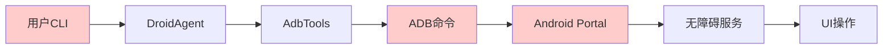
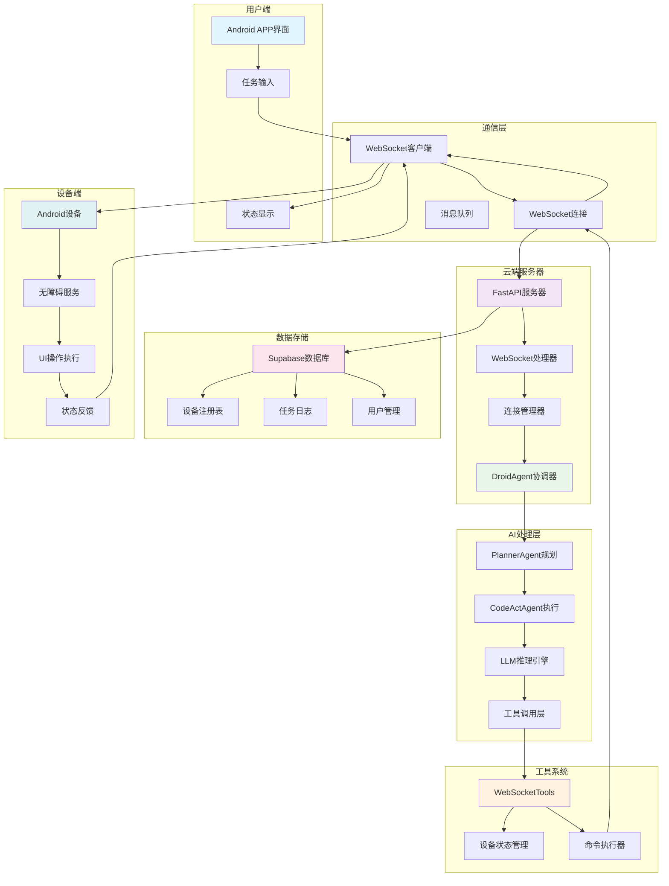
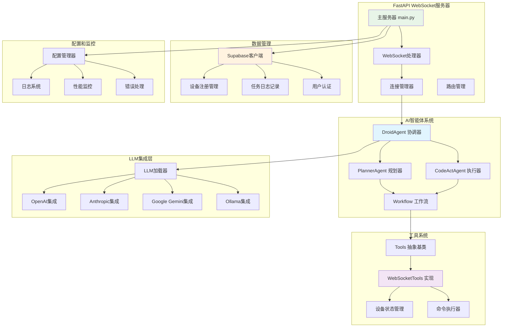
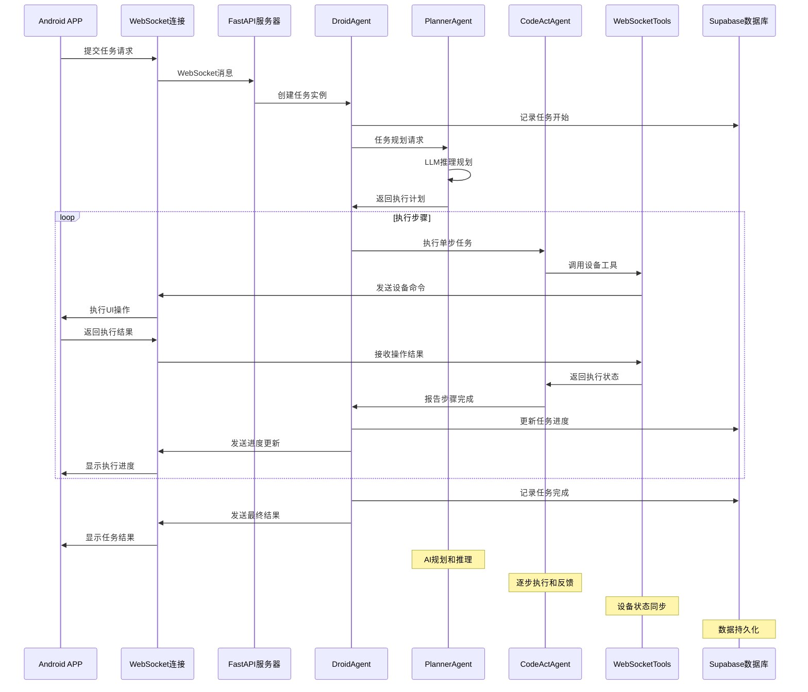
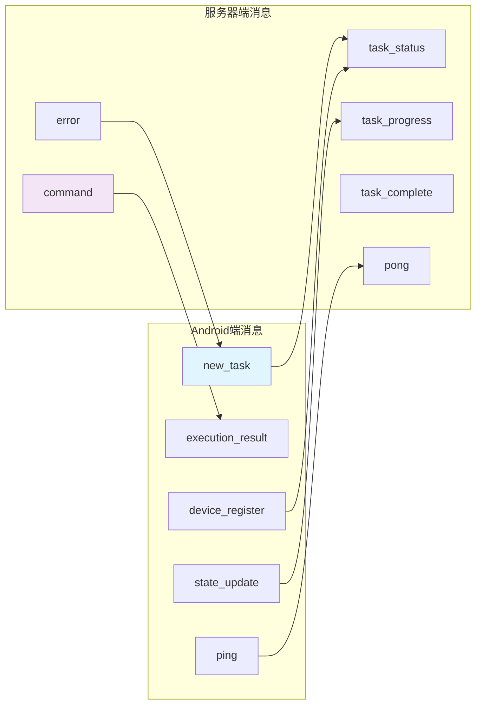

# DroidRun Python框架 - 云端化改造指南

## 📋 改造概述

本指南详细说明如何将DroidRun Python框架从基于ADB的本地控制架构改造为云端WebSocket实时通信架构。改造后，框架将作为云端AI代理服务器，通过WebSocket与Android设备进行实时通信。

### 🎯 改造目标

- **通信方式转换**: 从ADB命令转为WebSocket实时通信
- **架构云端化**: 部署为云端FastAPI服务
- **工具层重构**: 新增WebSocketTools替代AdbTools
- **状态管理优化**: 实时状态同步和管理
- **数据库集成**: Supabase用户和设备管理

## 🏗️ 架构变化对比

### 原架构 (本地ADB模式)


### 新架构 (云端WebSocket模式)


### 🔧 核心组件架构



### 📊 数据流架构



### 🔄 WebSocket通信协议



## 🔧 核心改造任务

### 1. 新增WebSocketTools类

#### 1.1 创建WebSocketTools基础结构
**文件位置**: `droidrun/tools/websocket.py`

```python
from typing import Dict, Any, Optional
from fastapi import WebSocket
import asyncio
import json
import logging
from .tools import Tools

class WebSocketTools(Tools):
    """云端版本的Tools，通过WebSocket与设备实时通信"""
    
    def __init__(self, websocket: WebSocket, device_id: str):
        self.websocket = websocket
        self.device_id = device_id
        self.current_state = None
        self.waiting_for_result = False
        self.result_event = asyncio.Event()
        self.execution_result = None
        
        # 继承自Tools的属性
        self.last_screenshot = None
        self.reason = None
        self.success = None
        self.finished = False
        self.memory: List[str] = []
        self.screenshots: List[Dict[str, Any]] = []
```

#### 1.2 实现核心方法
需要实现Tools抽象基类的所有方法：

- `get_state()` - 获取设备状态
- `tap_by_index()` - 点击操作
- `input_text()` - 文本输入
- `swipe()` - 滑动操作
- `press_key()` - 按键操作
- `take_screenshot()` - 截图
- `get_installed_packages()` - 获取应用列表
- `launch_app()` - 启动应用

#### 1.3 WebSocket通信协议设计
**消息格式标准化**:

```python
# 发送给Android的指令格式
{
    "type": "command",
    "action": "tap_by_index",
    "params": {"index": 5},
    "request_id": "uuid-string"
}

# Android返回的结果格式
{
    "type": "result",
    "request_id": "uuid-string", 
    "success": true,
    "data": {...},
    "new_state": {...}
}
```

### 2. FastAPI WebSocket服务器

#### 2.1 创建主服务器文件
**文件位置**: `droidrun/server/main.py`

```python
from fastapi import FastAPI, WebSocket, WebSocketDisconnect
from fastapi.middleware.cors import CORSMiddleware
import asyncio
import logging
from typing import Dict
from ..agent.droid import DroidAgent
from ..agent.utils.llm_picker import load_llm
from ..tools.websocket import WebSocketTools
from .database import SupabaseManager

app = FastAPI(title="DroidRun Cloud Server")

# 添加CORS中间件
app.add_middleware(
    CORSMiddleware,
    allow_origins=["*"],
    allow_credentials=True,
    allow_methods=["*"],
    allow_headers=["*"],
)

# 全局连接管理器
class ConnectionManager:
    def __init__(self):
        self.active_connections: Dict[str, WebSocket] = {}
        self.device_agents: Dict[str, DroidAgent] = {}
    
    async def connect(self, websocket: WebSocket, device_id: str):
        await websocket.accept()
        self.active_connections[device_id] = websocket
        
    def disconnect(self, device_id: str):
        if device_id in self.active_connections:
            del self.active_connections[device_id]
        if device_id in self.device_agents:
            del self.device_agents[device_id]

manager = ConnectionManager()
```

#### 2.2 WebSocket端点实现
```python
@app.websocket("/ws/device/{device_id}")
async def device_websocket(websocket: WebSocket, device_id: str):
    """设备WebSocket连接端点"""
    await manager.connect(websocket, device_id)
    
    # 创建设备专用的Tools
    tools = WebSocketTools(websocket, device_id)
    
    try:
        while True:
            # 接收来自Android的消息
            message = await websocket.receive_json()
            
            if message["type"] == "new_task":
                # 处理新任务
                await handle_new_task(device_id, message, tools)
                
            elif message["type"] == "execution_result":
                # 处理执行结果
                await handle_execution_result(device_id, message, tools)
                
            elif message["type"] == "state_update":
                # 处理状态更新
                tools.update_state(message["state"])
                
    except WebSocketDisconnect:
        manager.disconnect(device_id)
        logging.info(f"Device {device_id} disconnected")
```

### 3. 数据库集成

#### 3.1 Supabase配置
**文件位置**: `droidrun/server/database.py`

```python
from supabase import create_client, Client
import os
from typing import Optional, Dict, Any

class SupabaseManager:
    def __init__(self):
        self.url = os.getenv("SUPABASE_URL")
        self.key = os.getenv("SUPABASE_ANON_KEY")
        self.client: Client = create_client(self.url, self.key)
    
    async def register_device(self, device_id: str, device_info: Dict[str, Any]):
        """注册设备"""
        result = self.client.table("devices").upsert({
            "device_id": device_id,
            "device_name": device_info.get("name"),
            "status": "online",
            "last_seen": "now()"
        }).execute()
        return result
    
    async def log_task(self, device_id: str, task_description: str, result: Dict[str, Any]):
        """记录任务日志"""
        result = self.client.table("task_logs").insert({
            "device_id": device_id,
            "task_description": task_description,
            "result": result
        }).execute()
        return result
```

#### 3.2 数据库表结构
```sql
-- 设备表
CREATE TABLE devices (
    id UUID PRIMARY KEY DEFAULT gen_random_uuid(),
    device_id TEXT UNIQUE NOT NULL,
    device_name TEXT,
    status TEXT DEFAULT 'offline',
    last_seen TIMESTAMP DEFAULT NOW(),
    user_id UUID REFERENCES auth.users(id),
    created_at TIMESTAMP DEFAULT NOW()
);

-- 任务日志表  
CREATE TABLE task_logs (
    id UUID PRIMARY KEY DEFAULT gen_random_uuid(),
    device_id TEXT REFERENCES devices(device_id),
    task_description TEXT NOT NULL,
    result JSONB,
    created_at TIMESTAMP DEFAULT NOW(),
    duration_ms INTEGER,
    success BOOLEAN
);

-- 用户表 (Supabase Auth自动创建)
-- 设备会话表
CREATE TABLE device_sessions (
    id UUID PRIMARY KEY DEFAULT gen_random_uuid(),
    device_id TEXT REFERENCES devices(device_id),
    session_start TIMESTAMP DEFAULT NOW(),
    session_end TIMESTAMP,
    is_active BOOLEAN DEFAULT true
);
```

### 4. 配置和部署

#### 4.1 环境配置
**文件位置**: `droidrun/server/config.py`

```python
import os
from pydantic import BaseSettings

class Settings(BaseSettings):
    # Supabase配置
    supabase_url: str = os.getenv("SUPABASE_URL")
    supabase_anon_key: str = os.getenv("SUPABASE_ANON_KEY")
    
    # LLM配置
    default_llm_provider: str = "GoogleGenAI"
    default_llm_model: str = "gemini-2.5-flash"
    
    # 服务器配置
    host: str = "0.0.0.0"
    port: int = 8000
    debug: bool = False
    
    # WebSocket配置
    websocket_timeout: int = 300  # 5分钟
    max_connections_per_device: int = 1
    
    class Config:
        env_file = ".env"

settings = Settings()
```

#### 4.2 Docker部署配置
**文件位置**: `Dockerfile`

```dockerfile
FROM python:3.11-slim

WORKDIR /app

# 安装系统依赖
RUN apt-get update && apt-get install -y \
    gcc \
    && rm -rf /var/lib/apt/lists/*

# 复制依赖文件
COPY requirements.txt .
RUN pip install --no-cache-dir -r requirements.txt

# 复制源代码
COPY . .

# 暴露端口
EXPOSE 8000

# 启动命令
CMD ["uvicorn", "droidrun.server.main:app", "--host", "0.0.0.0", "--port", "8000"]
```

### 5. CLI工具适配

#### 5.1 云端CLI工具
**文件位置**: `droidrun/cli/main.py` (重写)

```python
@click.command()
@click.argument("command")
@click.option("--server-url", default="ws://localhost:8000", help="WebSocket服务器地址")
@click.option("--device-id", required=True, help="目标设备ID")
@click.option("--timeout", default=300, help="任务超时时间(秒)")
def run(command: str, server_url: str, device_id: str, timeout: int):
    """运行DroidRun云端命令"""
    asyncio.run(run_cloud_command(command, server_url, device_id, timeout))

async def run_cloud_command(command: str, server_url: str, device_id: str, timeout: int):
    """执行云端命令"""
    import websockets
    import asyncio

    uri = f"{server_url}/ws/device/{device_id}"

    try:
        async with websockets.connect(uri) as websocket:
            # 发送任务
            task_id = str(uuid.uuid4())
            await websocket.send(json.dumps({
                "type": "new_task",
                "task_id": task_id,
                "command": command,
                "timeout": timeout
            }))

            click.echo(f"任务已提交: {command}")
            click.echo(f"设备ID: {device_id}")
            click.echo("等待执行结果...")

            # 等待结果
            async with asyncio.timeout(timeout):
                async for message in websocket:
                    data = json.loads(message)

                    if data.get("task_id") == task_id:
                        if data["type"] == "task_progress":
                            click.echo(f"进度: {data['progress']}")
                        elif data["type"] == "task_complete":
                            success = data.get("success", False)
                            result = data.get("result", "")

                            if success:
                                click.echo(f"✅ 任务完成: {result}")
                            else:
                                click.echo(f"❌ 任务失败: {result}")
                            break

    except websockets.exceptions.ConnectionClosed:
        click.echo("❌ 与服务器连接断开")
    except asyncio.TimeoutError:
        click.echo(f"❌ 任务超时 ({timeout}秒)")
    except Exception as e:
        click.echo(f"❌ 执行错误: {str(e)}")
```

## 📦 依赖管理

### 6.1 新增依赖包
**文件位置**: `requirements.txt` (新增)

```txt
# 核心框架依赖
click>=8.1.0
rich>=13.0.0
pydantic>=2.0.0
aiofiles>=23.0.0
python-dotenv>=1.0.0
typing_extensions

# LLM集成依赖
openai>=1.0.0
anthropic>=0.7.0
llama-index
llama-index-llms-openai
llama-index-llms-openai-like
llama-index-llms-google-genai
llama-index-llms-deepseek
llama-index-llms-anthropic
llama-index-llms-ollama

# 图像处理
pillow>=10.0.0

# 云端服务依赖
fastapi==0.104.1
uvicorn[standard]==0.24.0
websockets==12.0
supabase==2.3.0
python-multipart==0.0.6

# 监控和日志
posthog==6.0.2
```

### 6.2 项目结构调整
```
droidrun/
├── droidrun/
│   ├── agent/              # AI智能体 (保持不变)
│   ├── tools/              # 工具层 (仅WebSocket)
│   │   ├── __init__.py     # 导出WebSocketTools
│   │   ├── tools.py        # 抽象基类
│   │   └── websocket.py    # WebSocket工具 (主要实现)
│   ├── server/             # 云端服务器
│   │   ├── __init__.py
│   │   ├── main.py         # FastAPI主服务器
│   │   ├── websocket_handler.py  # WebSocket处理器
│   │   ├── database.py     # Supabase数据库管理
│   │   └── config.py       # 配置管理
│   ├── cli/                # CLI工具 (仅云端模式)
│   └── utils/              # 工具函数
├── docs/                   # 文档
├── static/                 # 静态资源
├── tests/                  # 测试
├── docker-compose.yml      # Docker编排
├── Dockerfile              # Docker配置
└── .env.example            # 环境变量示例
```

## 🔄 实施策略

### 7.1 一步到位改造方案

#### 完整改造任务清单 (4周)
- [ ] **Week 1**: WebSocket通信层
  - [ ] 实现WebSocketTools完整类
  - [ ] 创建FastAPI WebSocket服务器
  - [ ] 建立WebSocket通信协议
  - [ ] 实现所有Tools接口方法

- [ ] **Week 2**: 数据库和服务集成
  - [ ] 集成Supabase数据库
  - [ ] 实现设备注册和管理
  - [ ] 添加任务日志记录
  - [ ] 集成DroidAgent与WebSocketTools

- [ ] **Week 3**: 错误处理和优化
  - [ ] 添加错误处理和重连机制
  - [ ] 实现状态同步和缓存
  - [ ] 性能优化和内存管理
  - [ ] CLI工具云端化适配

- [ ] **Week 4**: 部署和测试
  - [ ] Docker容器化部署
  - [ ] 全面测试和调试
  - [ ] 监控和日志系统
  - [ ] 文档更新和发布

### 7.2 移除组件
- **删除AdbTools**: 完全移除ADB相关代码
- **删除ADB依赖**: 移除所有ADB相关依赖包
- **简化CLI**: 只保留云端模式，移除本地模式选项
- **清理配置**: 移除ADB相关配置项

## 🧪 测试策略

### 8.1 单元测试
**文件位置**: `tests/test_websocket_tools.py`

```python
import pytest
import asyncio
from unittest.mock import AsyncMock, MagicMock
from droidrun.tools.websocket import WebSocketTools

@pytest.fixture
async def websocket_tools():
    mock_websocket = AsyncMock()
    tools = WebSocketTools(mock_websocket, "test_device")
    return tools, mock_websocket

@pytest.mark.asyncio
async def test_tap_by_index(websocket_tools):
    tools, mock_websocket = websocket_tools

    # 模拟WebSocket响应
    mock_websocket.send_json = AsyncMock()
    tools._wait_for_execution_result = AsyncMock(return_value={"success": True})

    result = await tools.tap_by_index(5)

    assert result == True
    mock_websocket.send_json.assert_called_once_with({
        "action": "tap",
        "index": 5
    })
```

### 8.2 集成测试
**文件位置**: `tests/test_websocket_integration.py`

```python
import pytest
from fastapi.testclient import TestClient
from droidrun.server.main import app

@pytest.fixture
def client():
    return TestClient(app)

def test_websocket_connection(client):
    with client.websocket_connect("/ws/device/test_device") as websocket:
        # 测试连接建立
        websocket.send_json({"type": "ping"})
        data = websocket.receive_json()
        assert data["type"] == "pong"
```

### 8.3 端到端测试
- 使用Android模拟器进行完整流程测试
- 测试WebSocket连接稳定性
- 验证AI智能体执行效果
- 性能和延迟测试

## 🚀 部署指南

### 9.1 本地开发环境
```bash
# 1. 安装依赖
pip install -e ".[dev]"

# 2. 配置环境变量
cp .env.example .env
# 编辑.env文件，填入Supabase配置

# 3. 启动开发服务器
uvicorn droidrun.server.main:app --reload --host 0.0.0.0 --port 8000

# 4. 测试WebSocket连接
python -m droidrun.cli.main "打开设置" --device-id test_device
```

### 9.2 Docker部署
```bash
# 1. 构建镜像
docker build -t droidrun-server .

# 2. 运行容器
docker run -d \
  --name droidrun-server \
  -p 8000:8000 \
  -e SUPABASE_URL=your_supabase_url \
  -e SUPABASE_ANON_KEY=your_supabase_key \
  droidrun-server

# 3. 使用docker-compose (推荐)
docker-compose up -d
```

### 9.3 云端部署 (阿里云)
```yaml
# docker-compose.yml
version: '3.8'
services:
  droidrun-server:
    build: .
    ports:
      - "8000:8000"
    environment:
      - SUPABASE_URL=${SUPABASE_URL}
      - SUPABASE_ANON_KEY=${SUPABASE_ANON_KEY}
      - DEFAULT_LLM_PROVIDER=GoogleGenAI
      - GEMINI_API_KEY=${GEMINI_API_KEY}
    restart: unless-stopped
    volumes:
      - ./logs:/app/logs
```

## 📊 监控和日志

### 10.1 日志配置
**文件位置**: `droidrun/server/logging_config.py`

```python
import logging
import sys
from pathlib import Path

def setup_logging(debug: bool = False):
    """配置日志系统"""
    level = logging.DEBUG if debug else logging.INFO

    # 创建日志目录
    log_dir = Path("logs")
    log_dir.mkdir(exist_ok=True)

    # 配置格式
    formatter = logging.Formatter(
        '%(asctime)s - %(name)s - %(levelname)s - %(message)s'
    )

    # 文件处理器
    file_handler = logging.FileHandler(log_dir / "droidrun_server.log")
    file_handler.setFormatter(formatter)

    # 控制台处理器
    console_handler = logging.StreamHandler(sys.stdout)
    console_handler.setFormatter(formatter)

    # 配置根日志器
    root_logger = logging.getLogger()
    root_logger.setLevel(level)
    root_logger.addHandler(file_handler)
    root_logger.addHandler(console_handler)
```

### 10.2 性能监控
- WebSocket连接数监控
- 任务执行时间统计
- 错误率和成功率追踪
- 设备在线状态监控

## ⚠️ 注意事项和限制

### 11.1 功能限制
云端化架构的功能限制：
- **网络依赖**: 必须有稳定的网络连接
- **延迟增加**: WebSocket通信会有网络延迟
- **设备权限**: 依赖Android无障碍服务权限
- **系统限制**: 受Android系统安全限制

### 11.2 性能考虑
- **网络延迟**: WebSocket通信会增加延迟
- **连接稳定性**: 需要实现重连机制
- **并发限制**: 单设备建议限制并发连接数
- **资源消耗**: 云端服务器需要足够资源

### 11.3 安全考虑
- **设备认证**: 实现设备ID验证
- **数据加密**: WebSocket使用WSS加密
- **访问控制**: 限制设备访问权限
- **日志脱敏**: 避免记录敏感信息

## 📚 相关文档

- [WebSocket通信协议规范](docs/websocket-protocol.md)
- [部署运维指南](docs/deployment-guide.md)
- [API接口文档](docs/api-reference.md)
- [故障排除指南](docs/troubleshooting.md)

---

**改造完成后，DroidRun将成为一个强大的云端AI设备控制平台，支持远程控制、多设备管理和实时协作。**
